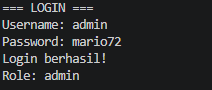

# Mini-Project-2-DDP
Berisi Tugas Mini Project ddp 2

program ini merupakan sistem pendataan jadwal rilis game yang digunakan untuk menambah,melihat,mengubah,dan menghapus data game.
program menggunakan sistem login dengan dua role, yaitu admin dan user.admin memiliki akses CRUD, sedangkan user hanya lihat data game.

Program menggunakan dictionary untuk mentimpan data dan function untuk menjalankan setiap proses.
program juga menggunakan library datettime untuk melakukan validasi tanggal rilis.

Program meminta pengguna memasukkan username dan password. Jika data login benar, program menampilkan pesan login berhasil dan role pengguna.

Program meminta pengguna memasukkan username dan password. Jika data login benar, program menampilkan pesan login berhasil dan role pengguna.

Program menampilkan data game yang sudah tersimpan, seperti nama game, platform, dan tanggal rilis.

Admin memilih data game yang ingin diubah, kemudian memasukkan data baru. Data yang valid akan diperbarui di dalam Dictionary.

Admin atau user dapat memilih menu logout. Setelah logout berhasil, program akan kembali ke halaman login.

Program dimulai dengan proses login menggunakan username dan password. Jika login berhasil, sistem akan mengecek role pengguna.

Admin dapat menambah, melihat, mengubah, dan menghapus data game. Sedangkan user hanya dapat melihat data game.

Pada proses tambah dan ubah data, program melakukan validasi data dan tanggal rilis. Setelah logout, pengguna akan kembali ke halaman login.
